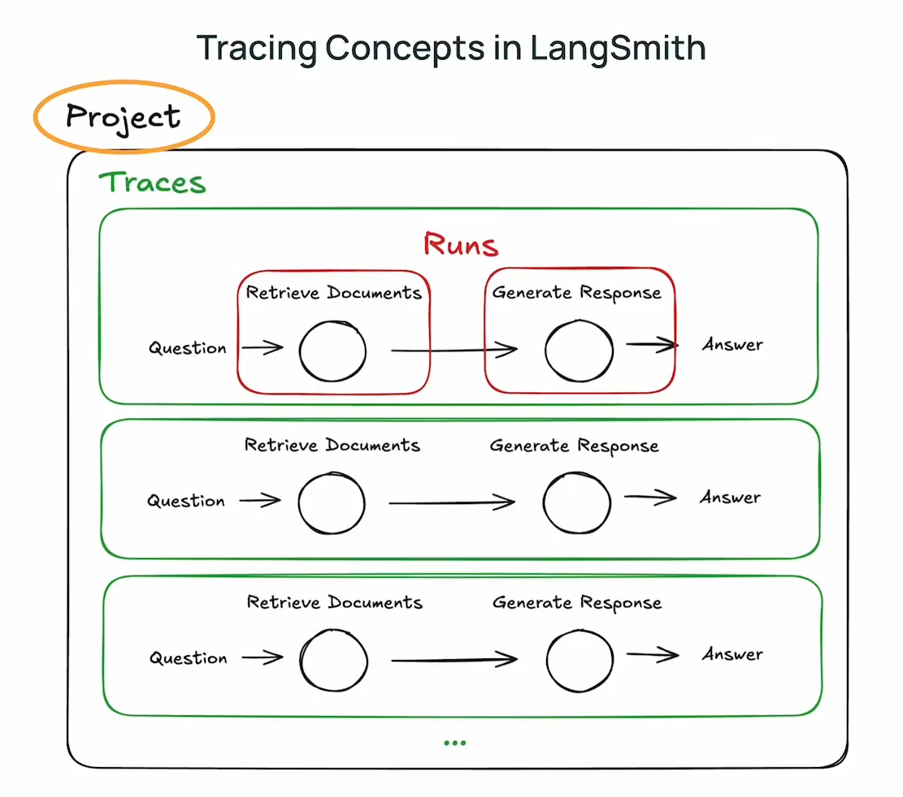
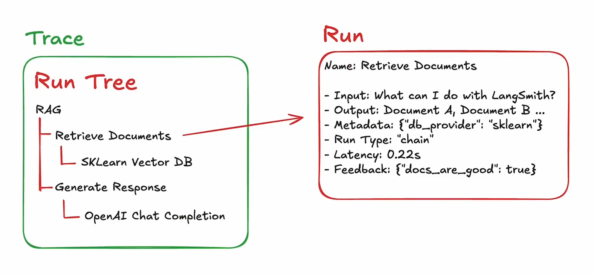
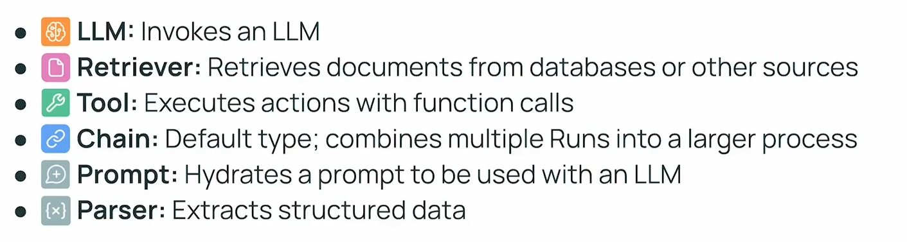

# What is LangSmith?

# An agent observability platform

::: notes
It let's you see agents and test or compare them. 
:::

<!-- ## image of langsmith UI

Basically something to help them see the scope of LangSmith

::: notes
I think this is one of the most valuable skills in industry and will stick around.
::: -->

::: notes
It has a lot of functions, but for now, we're covering the most fundamental: Tracing
:::

## The Problem

Pictures of (notebook output) and (ChatGPT interface) side by side

::: notes
When you only see this, it doesn't tell you much. 

When the steps become many, and something goes wrong, you want to know where

Did it... or...?

So we have traces
:::

##

::: notes
Traces are a deep record of an agent's run
:::

##

::: notes
Each run has nested runs inside it

They all have metadata
:::

##

<!-- Show a screenshot, then click around an acutal trace -->

## Your Turn

- Click around shared traces
- Identify the following run types:

- Bonus: Discuss whether the agent behaved expectedly and if its output at each stage is ideal

::: notes
When they start discussing how the output should behave, bring it back for a group discussion. They can navigate the trace on the project if they would like.
:::

## Rest of Class

- Primer and practice
    - Continue setting up
    - Run your own trace

<!-- All these failure modes https://latitude.so/blog/ai-agent-failure-detection-guide

- Context loss
- Infinite loops
- Tool misuse
- Cascading errors -->